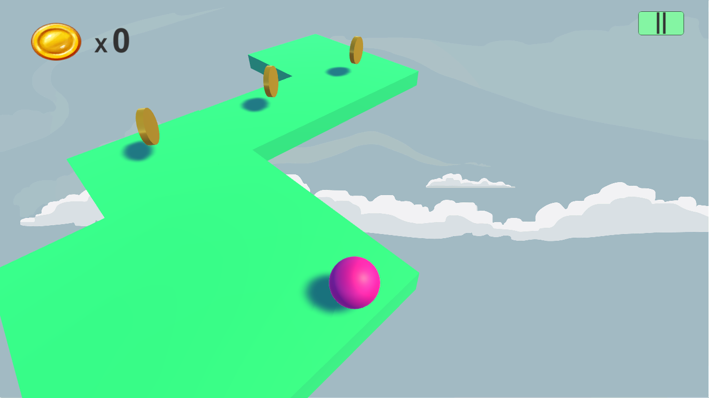
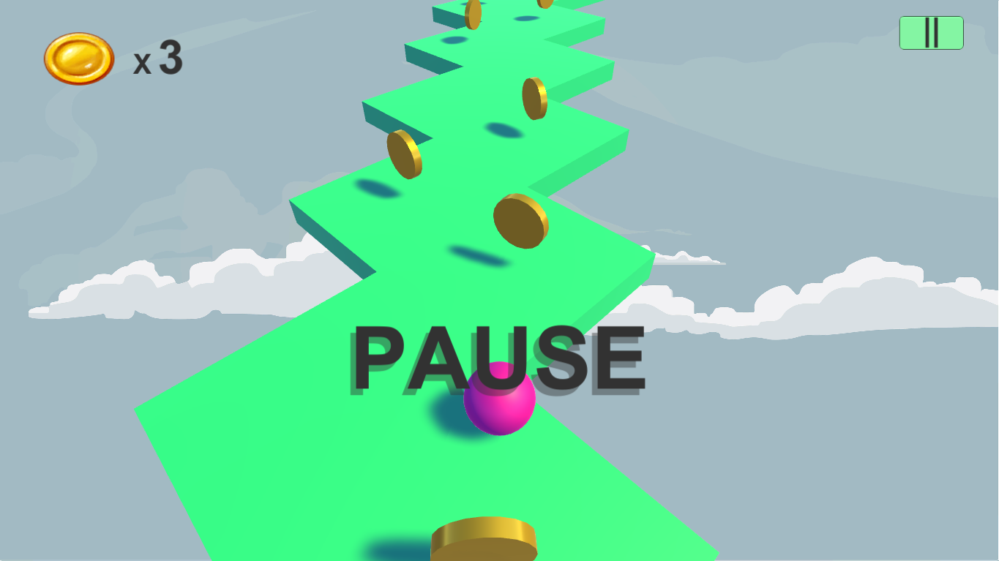
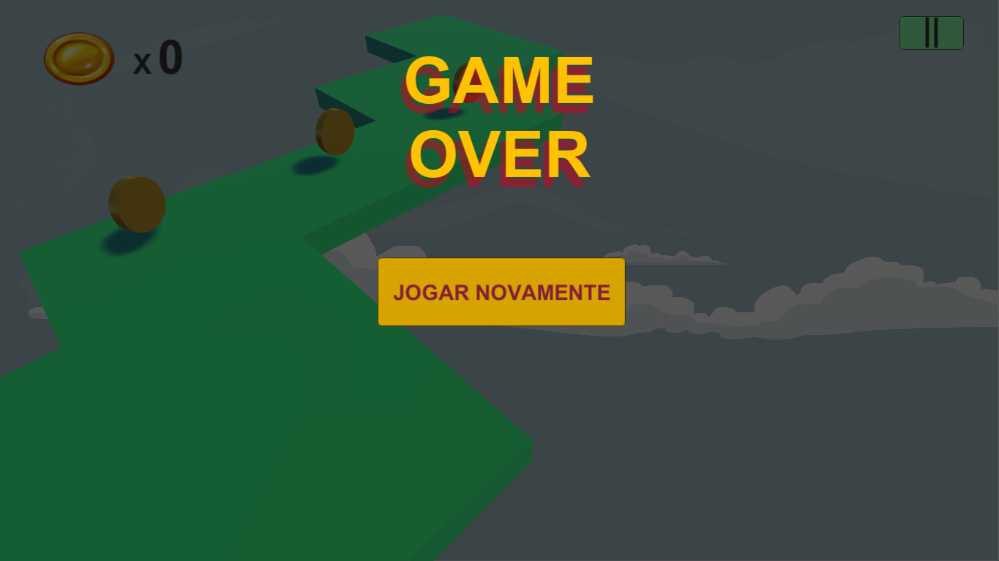

<p align="center">
 
</p>

## Overview 
<div>
 
 
 
</div>

## About
Zig Zag is a simple game where you controll a ball with your `spacebar` to catch the maximum of coins!<br/>
This project was developed during the course "__[Jogos 3D com Unity + modo multiplayer](https://www.udemy.com/course/jogos-3d-com-unity-2017-modo-multiplayer/)__".

## Technologies 
This project was built with:
- [Unity](https://unity.com/)
 
## Contribute
 1. Fork this repository;
 2. Create a branch with your feature: ```git checkout -b my-feature```
 3. Commit your changes: ```git commit -m 'feat: My new feature'```
 4. Push your branch: ```git push origin my-feature```
 
## License
This project is under the MIT license. Take a look at the [LICENSE](LICENSE) file for more details.
